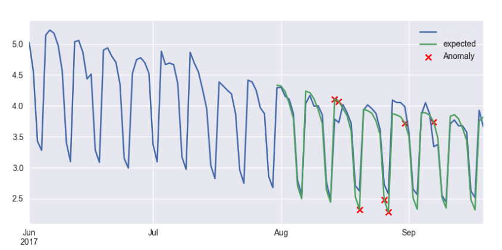

# Lecture #5: Time Series Analysis

_October 29 2019_

## Why?

* Time is a natural [dimension](https://en.wikipedia.org/wiki/Dimension_(data_warehouse)) of most data.
* Ability to visualize, understand, explain, and predict time series is very valuable skill, but definitely non-trivial one.
* It can be much easier if you use the right tools. Let's see what the Python environment can offer...

## ...on your own!

1. Pick data set of your choice, some examples:
   1. [Monthly milk production](https://datamarket.com/data/set/22ox/monthly-milk-production-pounds-per-cow-jan-62-dec-75#!ds=22ox&display=line)
   2. [CO2 (ppm) mauna loa](https://datamarket.com/data/set/22v1/co2-ppm-mauna-loa-1965-1980#!ds=22v1&display=line)
   3. [Mean daily temperature, Fisher River near Dallas](https://datamarket.com/data/set/235d/mean-daily-temperature-fisher-river-near-dallas-jan-01-1988-to-dec-31-1991#!ds=235d&display=line)
   4. [Wisconsin employment time series, trade](https://datamarket.com/data/set/22l8/wisconsin-employment-time-series-trade-jan-1961-oct-1975#!ds=22l8&display=line)
   5. [Monthly car sales in Quebec 1960-1968](https://datamarket.com/data/set/22n4/monthly-car-sales-in-quebec-1960-1968#!ds=22n4&display=line)
2. Load and inspect the data. Remember to take care of missing data, measurements in non-fixes intervals, etc. Pandas provide greate resources for this tasks, see the [time series documentation](https://pandas.pydata.org/pandas-docs/stable/timeseries.html).
3. Using a model of your choice (e.g. regression analysis, ARIMA, neural networks, ... use Google, chances are it is already implemented in Python) predict a selected time frame and compare result of the model with reality.

Example:

Last, but not least, *add your results to this repository* via [pull request](https://help.github.com/articles/about-pull-requests/). 
The pull request should consist of ideally two files:

1. `assignments\01_<your_username>.ipynb` - standard Jupyter notebook with your solution
2. `assignments\01_<your_username>.py` - plain text version of the notebook (File -> Download as Python), which will be useful in the "code review" phase

_Inspiration_: 
* [Time Series Forecast Study with Python: Monthly Sales of French Champagne](https://machinelearningmastery.com/time-series-forecast-study-python-monthly-sales-french-champagne/)
* [Time Series Prediction with LSTM Recurrent Neural Networks in Python with Keras](https://machinelearningmastery.com/time-series-prediction-lstm-recurrent-neural-networks-python-keras/)
* [Prophet](https://github.com/facebook/prophet)

Enjoy, but proceed with caution.
